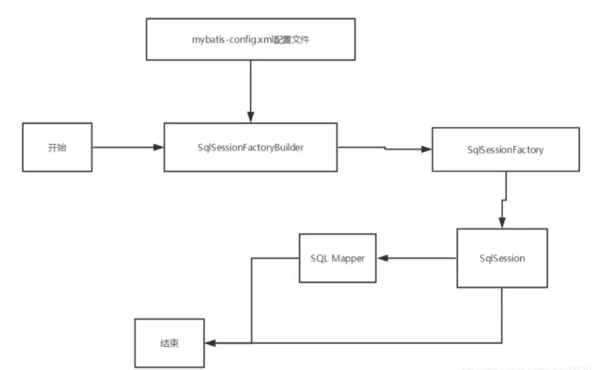
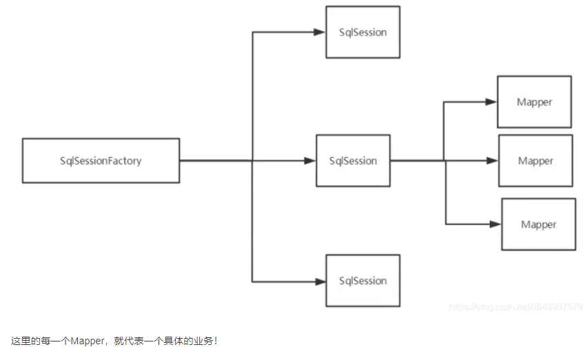
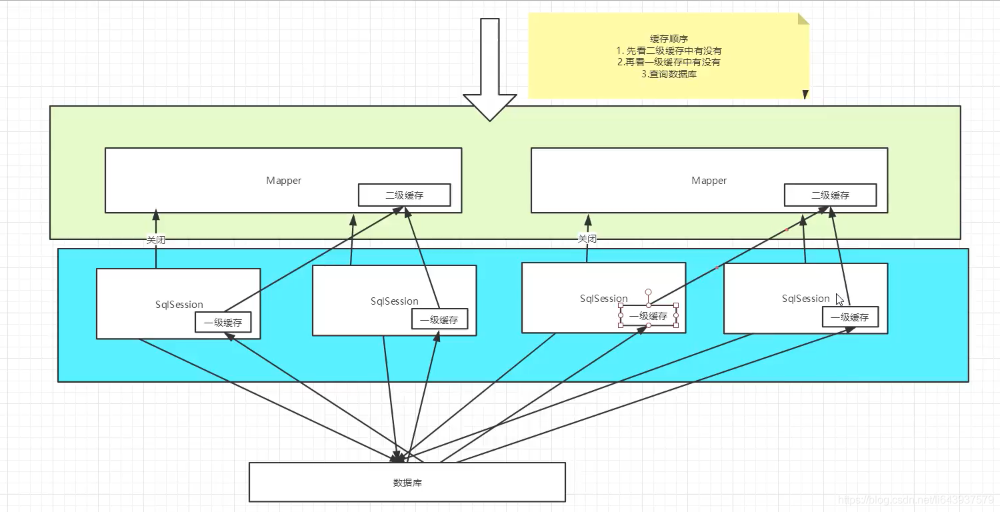

# Mybatis

## 生命周期和作用域




生命周期和作用域是至关重要的，因为错误的使用会导致非常严重的**并发问题**。

**SqlSessionFactoryBuilder：**

- 一旦创建了 SqlSessionFactory，就不再需要它了。
- 局部变量

**SqlSessionFactory：**

说白就是可以想象为：数据库连接池。
SqlSessionFactory 一旦被创建就应该在应用的运行期间一直存在，没有任何理由丢弃它或重新创建另一个实例。
SqlSessionFactory 的最佳作用域是应用作用域。
最简单的就是使用单例模式或者静态单例模式。

**SqlSession：**

- 连接到连接池的一个请求！
- SqlSession 的实例不是线程安全的，因此是不能被共享的，所以它的最佳的作用域是请求或方法作用域。
- 用完后需要赶紧关闭，否则资源被占用！




## 面向接口编程

- 之前学过面向对象编程，也学习过接口，但在真正的开发中，很多时候会选择面向接口编程。
- 根本原因：解耦，可拓展，提高复用，分层开发中，上层不用管具体的实现，大家都遵守共同的标准，使得开发变得容易，规范性更好
- 在一个面向对象的系统中，系统的各种功能是由许许多多的不同对象协作完成的。在这种情况下，各个对象内部是如何实现自己的，对系统设计人员来讲就不那么重要了；
- 而各个对象之间的协作关系则成为系统设计的关键。小到不同类之间的通信，大到各模块之间的交互，在系统设计之初都是要着重考虑的，这也是系统设计的主要工作内容。面向接口编程就是指按照这种思想来编程。
  


## XML方式


## 注解方式


## 一对多/多对一


1. 关联-association【多对一】

```xml
    <!-- 按照查询嵌套处理
            思路：
         1.查询所有的学生信息
         2.根据查询出来的学生的tid，寻找对应的老师！ 子查询-->
    <select id="getStudent" resultMap="StudentTeacher">
        select * from mybatis.student
    </select>

    <resultMap id="StudentTeacher" type="Student">
        <result property="id" column="id"/>
        <result property="name" column="name"/>
        <!--  复杂的属性，我们需要单独处理 对象：association 集合：collection      -->
        <association property="teacher" column="tid" javaType="Teacher" select="getTeacher"/>
    </resultMap>

    <select id="getTeacher" resultType="Teacher">
        select * from mybatis.teacher where id = #{id}
    </select>

```


```xml
<!--按照结果嵌套处理    -->
<select id="getStudent2" resultMap="StudentTeacher2">
    select s.id sid,s.name sname,t.name tname
    from mybatis.student s,mybatis.teacher t
    where s.tid = t.id
</select>

<resultMap id="StudentTeacher2" type="Student">
    <result property="id" column="sid"/>
    <result property="name" column="sname"/>
    <association property="teacher" javaType="Teacher">
        <result property="name" column="tname"/>
    </association>
</resultMap>
```


1. 集合-collection【一对多】
2. javaType & ofType
   1. javaType 用来指定实体类中属性的类型
   2. ofType 用来指定映射到List或者集合中的pojo类型，泛型中的约束类型！

```xml
<!--    按结果嵌套查询-->
<select id="getTeacher" resultMap="TeacherStudent">
        SELECT  s.id sid,s.name sname,t.name tname,t.id,tid
        from student s,teacher t
        where s.tid = t.id and t.id = #{tid}
</select>

<resultMap id="TeacherStudent" type="Teacher">
    <result property="id" column="tid"/>
    <result property="name" column="tname"/>
    <!--  复杂的属性，我们需要单独处理 对象：association 集合：collection
         javaType="" 指定属性的类型！
         集合中的泛型信息，我们使用ofType获取
         -->
    <collection property="students" ofType="Student">
        <result property="id" column="sid"/>
        <result property="name" column="sname"/>
        <result property="tid" column="tid"/>
    </collection>
</resultMap>
```


```xml
<!--    按照查询嵌套处理-->
<select id="getTeacher2" resultMap="TeacherStudent2">
    select * from mybatis.teacher where id = #{tid}
</select>

<resultMap id="TeacherStudent2" type="Teacher">
    <collection property="students" javaType="ArrayList" ofType="Student" select="getStudentByTeacherId" column="id"/>
</resultMap>

<select id="getStudentByTeacherId" resultType="Student">
    select * from  mybatis.student where tid = #{tid}
</select>
```


## 动态SQL


**什么是动态SQL：动态SQL就是 指根据不同的条件生成不同的SQL语句**


### IF

### Choose(when,otherwise)  

### trim(where,set)

where 会移除and or 

set 会移除逗号


trim规定取消指定的前缀，后缀

属性名	属性解释
prefix               	   要添加的前缀。比如这里因为没有使用WHERE，按照语法格式条件必须要有WHERE。此时就可以使用prefix属性给整个条件语句块前面添加一个WHERE关键字。
prefixOverrides	 要删除的前缀。如果多出来指定的前缀，则将这些多出来的前缀修剪去除。比如:如果在整个语句中需要修剪去`AND
suffix	                   要添加的后缀。使用方式与prefix类似，只是prefix是增加前缀，而suffix是添加一个后缀在被包裹的语句块中。
suffixOverrides	  要删除的后缀。使用方式与prefixOverrides类似，只是一个是去除前面多余的关键字，suffixOverrides是删除多余后面的。


**所谓的动态SQL，本质还是SQL语句，只是我们可以在SQL层面，去执行一个逻辑代码**


### SQL片段

有的时候，我们可以能会将一些功能的部分抽取出来，方便复用！  <include refid=""></include>

1. 使用SQL标签抽取公共的部分

   ```xml
   <sql id="if-title-author">
       <if test="title != null">
           title = #{title}
       </if>
       <if test="author != null">
           and author = #{author}
       </if>
   </sql>
   ```


2.在需要使用的地方使用Include标签引用即可

```xml
<select id="queryBlogIF" parameterType="map" resultType="Blog">
    select * from mybatis.blog
    <where>
        <include refid="if-title-author"></include>
    </where>
</select>
```


### Foreach

动态 SQL 的另一个常见使用场景是对集合进行遍历（尤其是在构建 IN 条件语句的时候）。

foreach 元素的功能非常强大，它允许你指定一个集合，声明可以在元素体内使用的集合项（item）和索引（index）变量。它也允许你指定开头与结尾的字符串以及集合项迭代之间的分隔符。这个元素也不会错误地添加多余的分隔符，看它多智能！

提示你可以将任何可迭代对象（如 List、Set 等）、Map 对象或者数组对象作为集合参数传递给 foreach。当使用可迭代对象或者数组时，index 是当前迭代的序号，item 的值是本次迭代获取到的元素。当使用 Map 对象（或者 Map.Entry 对象的集合）时，index 是键，item 是值。


## 缓存

#### 1. 什么是缓存[Cache]？

- 存在内存中的临时数据。
- 将用户经常查询的数据放在缓存（内存）中，用户去查询数据就不用从磁盘上（关系型数据库查询文件）查询，从缓存中查询，从而提高查询效率，解决了高并发系统的性能问题。

#### 2. 为什么使用缓存？

- 减少和数据库的交互次数，减少系统开销，提高系统效率。

#### 3. 什么样的数据能使用缓存？

- 经常查询并且不经常改变的数据。【可以使用缓存】


## Mybatis缓存

Mybatis包含一个非常强大的查询缓存特性，它可以非常方便地定制和配置缓存。缓存可以极大的提升查询效率。
Mybatis系统中默认定义了两级缓存：一级缓存和二级缓存
默认情况下，只有一级缓存开启。（SqlSession级别的缓存，也称为本地缓存）
二级缓存需要手动开启和配置，它是基于namespace级别的缓存。
为了提高扩展性，Mybatis定义了缓存接口Cache，我们可以通过实现Cache接口来自定义二级缓存。一级缓存

### 一级缓存也叫本地缓存：

- 与数据库同一次会话期间查询到的数据会放在本地缓存中。
- 以后如果需要获取相同的数据，直接从缓存中拿，没必要再去查询数据库

**小结**：一级缓存默认是开启的，只在一次SqlSession中有效，也就是拿到连接到关闭连接这个区间段！
一级缓存相当于一个Map。


### 二级缓存

- 二级缓存也叫全局缓存，一级缓存作用域太低了，所以诞生了二级缓存；
- 基于namespace级别的缓存，一个名称空间，对应一个二级缓存；
- 工作机制
  - 一个会话查询一条数据，这个数据就会被放在当前会话的一级缓存中；
  - 如果当前会话关闭了，这个会话对应的一级缓存就没了；但是我们想要的是，会话关闭了，一级缓存中的数据被保存到二级缓存中；
  - 新的会话查询信息，就可以从二级缓存中获取内容；
  - 不同的mapper查出的数据就会放在自己对应的缓存（map）中；

步骤:

1. 在mybatis-config.xml开启全局缓存
2. 在要使用二级缓存的Mapper中开启

小结：

- 只要开启了二级缓存，在同一个Mapper下就有效；
- 所有的数据都会先放在一级缓存中；
- 只有当会话提交或者关闭的时候，才会提交到二级缓存中！


## 缓存原理




## 自定义缓存ehcache

Ehcache是一种广泛使用的开源Java分布式缓存，主要面向通用缓存。

要在程序中使用ehcache，先要导包！

在mapper中指定使用我们的ehcache缓存实现！

**目前：Redis数据库来做缓存！K-V**